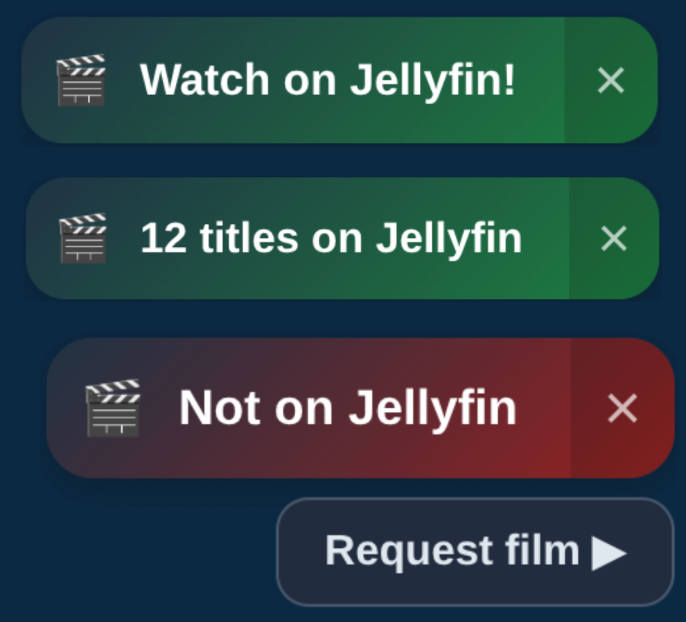
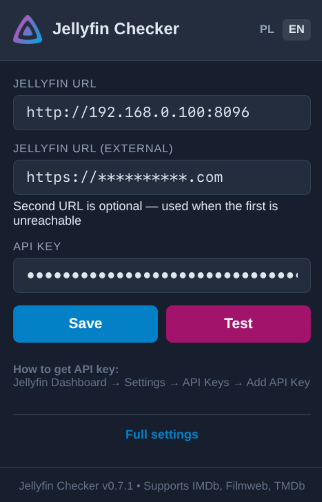
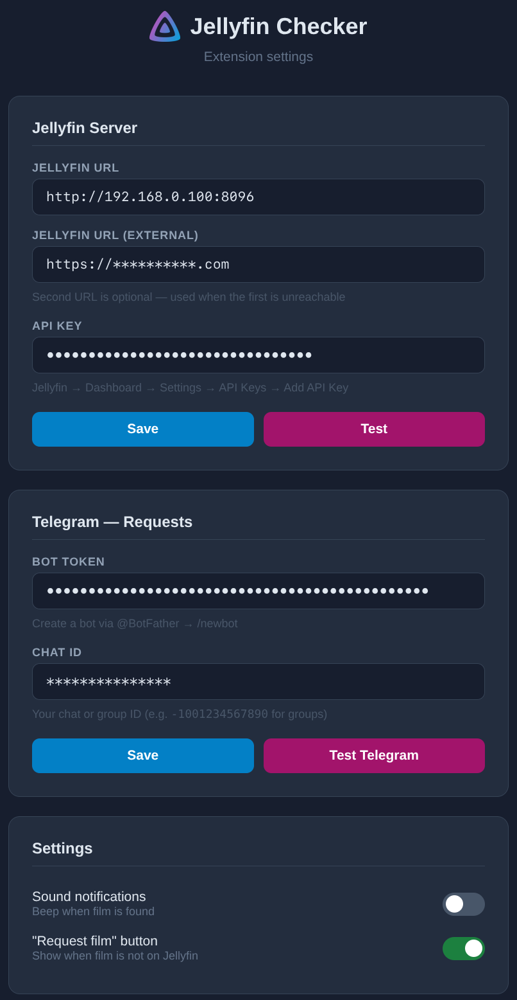
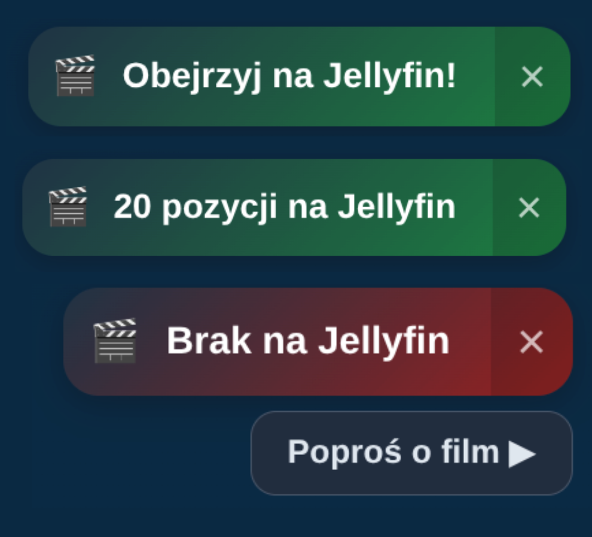
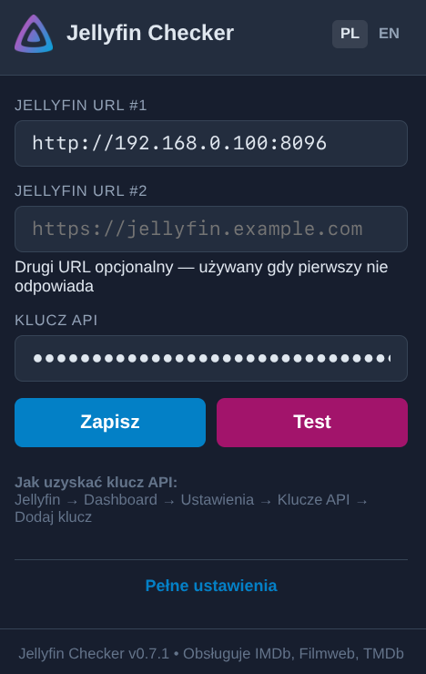
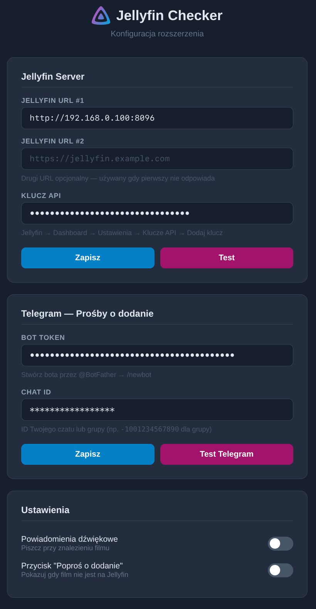

# Jellyfin Checker

> 🛠️ **Hobby project**  
> *EN:* I built this because I missed this feature. Use at your own risk. Ideas and feedback welcome!  
> *PL:* Brakowało mi tej funkcjonalności. Używaj na własną rękę. Pomysły i sugestie mile widziane!

[🇵🇱 Polski](#-polski)

---

## 🇬🇧 English

A browser extension that checks in real-time if movies, shows, or people are available on your Jellyfin server while browsing **IMDb**, **Filmweb**, or **The Movie Database (TMDb)**.


### Features

- **Auto-detection** — recognizes movie/show/person pages automatically
- **Multiple sources** — works on IMDb, Filmweb, and TMDb
- **Smart search** — cascading strategy: provider ID → exact title → fuzzy match (Levenshtein)
- **Multiple URLs** — supports local + remote Jellyfin endpoints
- **Telegram** — optional "Request film" button sends a notification via Telegram
- **Bilingual** — Polish and English UI
- **Dark theme** — matches modern browser UI

### How it works

1. Visit a movie, show, or person page on **IMDb**, **Filmweb**, or **TMDb**
2. The extension searches your Jellyfin library via API
3. A badge appears in the top-right corner with the result



#### Badge states

| State | Meaning |
|-------|---------|
| ✅ Found | Item exists on Jellyfin — click to open |
| ✅ Found many (person page) | Multiple items found for this person |
| ❌ Not found | Item missing from Jellyfin |
| 🔍 Searching | Query in progress |
| ⚠️ Warning | Connection error or missing config |

#### Screenshots

| Popup | Options |
|-------|---------|
|  |  |

#### Search strategy

1. **Provider ID** — exact match by IMDb ID (`anyProviderIdEquals`)
2. **TMDb ID** — exact match by TMDb ID
3. **Person search** — finds items by person name
4. **Fuzzy search** — title matching with Levenshtein + year validation
5. **Original title fallback** — for Filmweb, tries the English original title

### Installation

1. Clone this repository: `git clone https://github.com/patientone-io/jellyfin-checker.git`
2. Build for your browser:
   ```bash
   cd jellyfin-checker
   bash build.sh chrome    # for Chrome / Edge / Brave
   bash build.sh firefox   # for Firefox
   ```
3. Open your browser's extensions page:
   - **Chrome**: `chrome://extensions`
   - **Edge**: `edge://extensions`
   - **Brave**: `brave://extensions`
   - **Firefox**: `about:debugging#/runtime/this-firefox`
4. Enable **Developer mode** (Chrome/Edge/Brave)
5. Click **Load unpacked** → select the `dist/chrome` or `dist/firefox` folder

### Configuration

Click the extension icon in your browser toolbar.

1. **Jellyfin URL** — your server address (e.g. `http://192.168.1.100:8096`)
   - Add **Jellyfin URL #2** as fallback (e.g. remote address)
2. **API Key** — generate in Jellyfin: `Dashboard → Settings → API Keys → + Add API Key`
3. Click **Save**, then **Test**

#### Telegram (optional)

Built for household members — when someone finds a movie that's not on your Jellyfin, they can request it via Telegram with one click. No Jellyfin knowledge needed.

1. Create a bot via [@BotFather](https://t.me/botfather) — `/newbot`
2. Get your Chat ID via [@userinfobot](https://t.me/userinfobot)
3. Enter both in **Settings** (`⚙️ Full settings` in the popup)
4. Click **Test Telegram**

### Supported sites

| Site | URL pattern | Search method |
|------|-------------|--------------|
| IMDb | `imdb.com/title/tt*` | Provider ID (imdb) |
| IMDb | `imdb.com/name/nm*` | Person name |
| IMDb (mobile) | `m.imdb.com/title/tt*` | Provider ID (imdb) |
| Filmweb | `filmweb.pl/film/*` | h2 original title → LD+JSON IMDb ID → fuzzy |
| Filmweb | `filmweb.pl/serial/*` | h2 original title → LD+JSON IMDb ID → fuzzy |
| Filmweb | `filmweb.pl/person/*` | Person name (cleaned) |
| TMDb | `themoviedb.org/movie/*` | Provider ID (tmdb) |
| TMDb | `themoviedb.org/tv/*` | Provider ID (tmdb) |

### File structure

```
jellyfin-checker/
├── src/                # Shared source files (same for all browsers)
│   ├── background.js   # Service worker / Event page — Jellyfin API logic
│   ├── content.js      # Metadata extraction + badge UI
│   ├── popup.html      # Configuration popup
│   ├── popup.js        # Popup logic (i18n, save, test)
│   ├── options.html    # Full settings page
│   ├── options.js      # Settings logic
│   ├── config.json     # Default config (no secrets)
│   ├── icon16.png      # 16×16 icon
│   ├── icon48.png      # 48×48 icon
│   ├── icon96.png      # 96×96 icon
│   ├── icon128.png     # 128×128 icon
│   └── screenshots/    # Preview images
├── chrome/
│   └── manifest.json   # Chrome manifest (MV3, service_worker)
├── firefox/
│   └── manifest.json   # Firefox manifest (MV3, scripts, options_ui)
├── build.sh            # Build script — run: bash build.sh <chrome|firefox>
├── .gitignore
├── LICENSE
└── README.md           # This file
```

### Security & Privacy

- **API keys stored in `chrome.storage.local`** — persistent, extension-only access
- **Default `config.json` contains no secrets** — all credentials configured via UI
- **No data collection** — no analytics, no third-party requests (except your own Jellyfin and Telegram if configured)

#### Pre-populating config.json for family

You can edit `config.json` before distribution to pre-fill server URL, API key, and Telegram settings — useful for family members who just need it to work. **Warning**: this stores secrets in plain text. Anyone with access to the extension folder can read them.

#### Why does the extension need access to all websites?

Your Jellyfin server can run on any address — `localhost`, a local IP (`192.168.x.x`), or a public domain. Since this can't be predicted at build time, the extension requests broad host permissions. The extension **does not** read or modify page content — it only connects to your configured Jellyfin server and optionally Telegram.

### Contributing

Contributions are welcome! This is a hobby project built for the Jellyfin community.

Ideas, bug reports, and PRs — open an Issue or submit a Pull Request. Found a bug? Include steps to reproduce, browser version, and Jellyfin version. Feature request? Describe what you need and why.

### License

MIT — use at your own risk.

Copyright © 2026 patientone

---

## 🇵🇱 Polski

Rozszerzenie przeglądarki, które w czasie rzeczywistym sprawdza, czy film, serial lub osoba znajduje się na Twoim serwerze Jellyfin — podczas przeglądania **IMDb**, **Filmweb** lub **The Movie Database (TMDb)**.


### Funkcje

- **Automatyczne wykrywanie** — rozpoznaje stronę filmu/serialu/osoby bez klikania
- **Wiele źródeł** — działa na IMDb, Filmweb i TMDb
- **Inteligentne wyszukiwanie** — strategia kaskadowa: ID providera → dokładny tytuł → fuzzy match (Levenshtein)
- **Wiele serwerów** — obsługuje kilka adresów Jellyfin (lokalny + zdalny), próbuje każdy po kolei
- **Telegram** — opcjonalny przycisk "Poproś o film" wysyła powiadomienie przez Telegrama
- **Dwujęzyczne** — PL i EN
- **Dark theme** — dopasowane do nowoczesnych przeglądarek

### Jak to działa?

1. Wejdź na stronę filmu/serialu/osoby na **IMDb**, **Filmweb** lub **TMDb**
2. Rozszerzenie automatycznie przeszukuje Twoją bibliotekę Jellyfin przez API
3. W prawym górnym rogu pojawia się badge z wynikiem



#### Stany badge'a

| Stan | Znaczenie |
|------|-----------|
| ✅ Znaleziony | Pozycja jest na Jellyfin — kliknij aby otworzyć |
| ✅ Znaleziono wiele (strona osoby) | Wiele pozycji dla tej osoby |
| ❌ Nie znaleziony | Brak pozycji na Jellyfin |
| 🔍 Szukam | Trwa zapytanie |
| ⚠️ Ostrzeżenie | Błąd połączenia lub brak konfiguracji |

#### Zrzuty ekranu

| Popup | Ustawienia |
|-------|------------|
|  |  |

#### Strategia wyszukiwania

1. **ID providera** — dokładne dopasowanie po ID IMDb (`anyProviderIdEquals`)
2. **ID TMDb** — dokładne dopasowanie po ID TMDb
3. **Osoba** — wyszukiwanie filmów/seriali po nazwisku osoby
4. **Fuzzy search** — dopasowanie tytułu z algorytmem Levenshteina + walidacja roku
5. **Oryginalny tytuł** — dla Filmwebu próbuje też angielski tytuł oryginalny

### Instalacja

1. Sklonuj repozytorium: `git clone https://github.com/patientone-io/jellyfin-checker.git`
2. Zbuduj dla swojej przeglądarki:
   ```bash
   cd jellyfin-checker
   bash build.sh chrome    # dla Chrome / Edge / Brave
   bash build.sh firefox   # dla Firefox
   ```
3. Otwórz stronę rozszerzeń:
   - **Chrome**: `chrome://extensions`
   - **Edge**: `edge://extensions`
   - **Brave**: `brave://extensions`
   - **Firefox**: `about:debugging#/runtime/this-firefox`
4. Włącz **Tryb programisty** (Chrome/Edge/Brave)
5. Kliknij **Wczytaj rozpakowane** → wybierz folder `dist/chrome` lub `dist/firefox`

### Konfiguracja

Kliknij ikonkę rozszerzenia na pasku przeglądarki.

1. **URL Jellyfin** — adres Twojego serwera (np. `http://192.168.1.100:8096`)
   - Dodaj **Jellyfin URL #2** jako zapasowy (np. adres zdalny)
2. **Klucz API** — wygeneruj w Jellyfin: `Dashboard → Ustawienia → Klucze API → + Dodaj klucz`
3. Kliknij **Zapisz**, następnie **Test**

#### Telegram (opcjonalnie)

Funkcja stworzona z myślą o domownikach — gdy ktoś znajdzie film na IMDb/Filmweb/TMDb, a nie ma go na Jellyfin, może jednym kliknięciem wysłać Ci prośbę o dodanie przez Telegrama. Nie musi znać się na Jellyfin — wystarczy, że ma włączone rozszerzenie.

1. Stwórz bota przez [@BotFather](https://t.me/botfather) — `/newbot`
2. Zdobądź Chat ID przez [@userinfobot](https://t.me/userinfobot)
3. Wpisz oba w **Ustawieniach** (`⚙️ Pełne ustawienia` w popupie)
4. Kliknij **Test Telegram**

### Obsługiwane strony

| Strona | Wzór URL | Metoda wyszukiwania |
|--------|----------|---------------------|
| IMDb | `imdb.com/title/tt*` | ID providera (imdb) |
| IMDb | `imdb.com/name/nm*` | Nazwa osoby |
| IMDb (mobile) | `m.imdb.com/title/tt*` | ID providera (imdb) |
| Filmweb | `filmweb.pl/film/*` | h2 oryginalny tytuł → LD+JSON IMDb ID → fuzzy |
| Filmweb | `filmweb.pl/serial/*` | h2 oryginalny tytuł → LD+JSON IMDb ID → fuzzy |
| Filmweb | `filmweb.pl/person/*` | Nazwa osoby (oczyszczona) |
| TMDb | `themoviedb.org/movie/*` | ID providera (tmdb) |
| TMDb | `themoviedb.org/tv/*` | ID providera (tmdb) |

### Struktura plików

```
jellyfin-checker/
├── src/                # Współdzielone pliki źródłowe (takie same dla obu przeglądarek)
│   ├── background.js   # Service worker / Event page — logika API Jellyfin
│   ├── content.js      # Ekstrakcja metadanych + badge UI
│   ├── popup.html      # Konfiguracja (popup)
│   ├── popup.js        # Obsługa popupu (i18n, zapis, test)
│   ├── options.html    # Pełne ustawienia
│   ├── options.js      # Logika ustawień
│   ├── config.json     # Domyślna konfiguracja (bez sekretów)
│   ├── icon16.png      # Ikona 16×16
│   ├── icon48.png      # Ikona 48×48
│   ├── icon96.png      # Ikona 96×96
│   ├── icon128.png     # Ikona 128×128
│   └── screenshots/    # Podglądy
├── chrome/
│   └── manifest.json   # Manifest Chrome (MV3, service_worker)
├── firefox/
│   └── manifest.json   # Manifest Firefox (MV3, scripts, options_ui)
├── build.sh            # Skrypt budowania — bash build.sh <chrome|firefox>
├── .gitignore
├── LICENSE
└── README.md           # Ta instrukcja
```

### Bezpieczeństwo i prywatność

- **Klucze API przechowywane w `chrome.storage.local`** — dane zapisane lokalnie, dostępne tylko dla rozszerzenia
- **Domyślny `config.json` nie zawiera sekretów** — wszystkie dane uwierzytelniające konfigurowane przez UI
- **Brak zbierania danych** — brak analityki, brak zapytań do stron trzecich (oprócz Twojego Jellyfin i Telegrama jeśli skonfigurowane)

#### Wstępna konfiguracja dla domowników

Możesz edytować `config.json` przed dystrybucją, aby wstępnie wypełnić URL serwera, klucz API i Telegram — przydatne dla domowników. **Uwaga**: to przechowuje sekrety w plain text. Każdy z dostępem do folderu rozszerzenia może je odczytać.

#### Dlaczego rozszerzenie prosi o dostęp do wszystkich stron?

Twój serwer Jellyfin może działać pod dowolnym adresem — localhost, lokalne IP lub domena publiczna. Nie da się tego przewidzieć na etapie budowania, dlatego rozszerzenie prosi o szerokie uprawnienia. Rozszerzenie **nie czyta i nie modyfikuje** treści stron — łączy się tylko ze skonfigurowanym serwerem Jellyfin i opcjonalnie Telegramem.

### Współpraca

Pomysły, zgłoszenia błędów i PR-y mile widziane! Znalazłeś błąd? Podaj kroki do reprodukcji, wersję przeglądarki i Jellyfina. Masz pomysł na funkcję? Opisz co i dlaczego.

### Licencja

MIT — używaj na własną odpowiedzialność.

Copyright © 2026 patientone

---

<p align="center">Built with ❤️ for the Jellyfin community</p>
